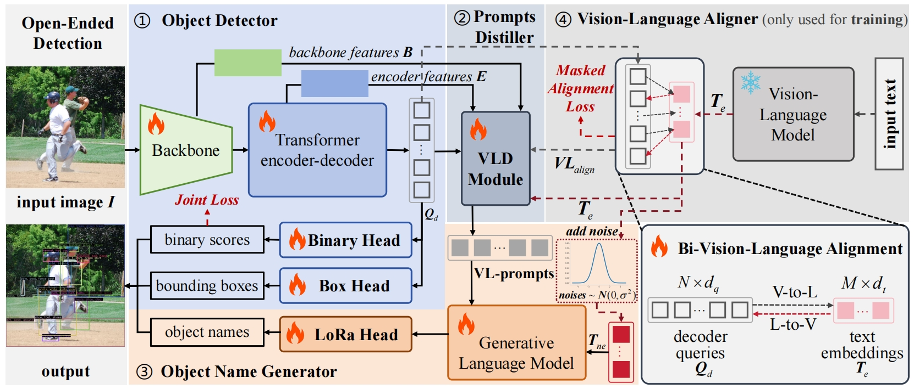
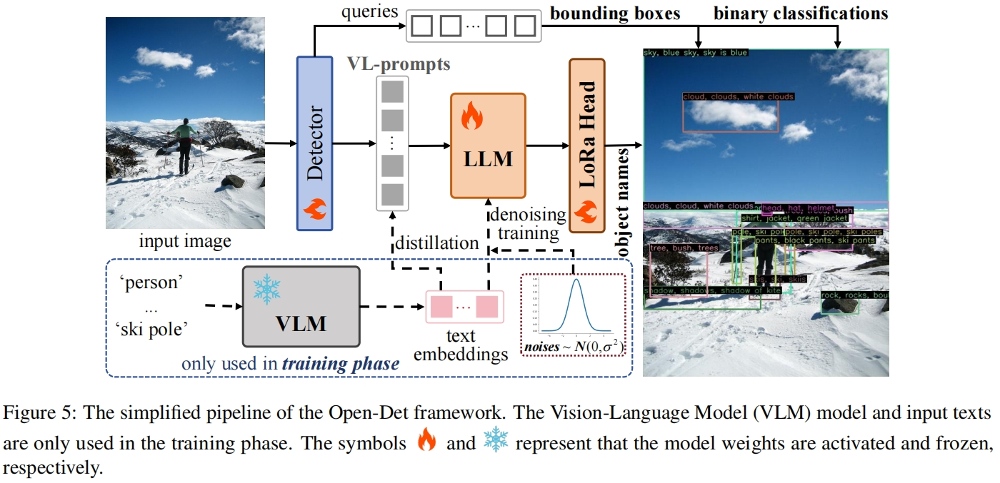
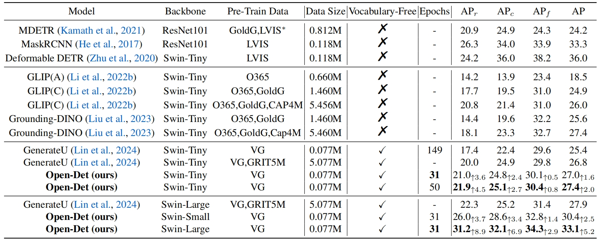
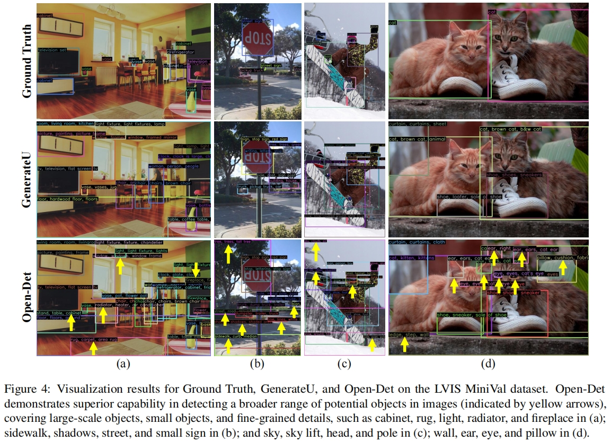

# Open-Det
This is the official code (based on Pytorch framework) for the paper "Open-Det: An Efficient Learning Framework for Open-Ended Detection".


## Updates

Source Codes: Comming Soon!

***01/05/2025***

`News`: Open-Det has been accepted to ICML 2025!

## Open-Det in Videos Detection
<div align=center>

</div>


## Highlight

* An efficient framework for Open-Ended object Detection: with 0.077M training data (VG) and less training epochs, using 4 V100 GPUs, achieving higher performance.

* Higher performace on ​cross-granularity and cross-scale objects detection.

## Framework



## The Simplified Pipeline of the Open-Det Framework


## Main Results


## Visualization Results


## Data Preparation of VG and LVIS data
For the data preparation, please follow the instructions from [GenerateU](https://github.com/FoundationVision/GenerateU) to download the training and evaluation data.

## Pretrained Models

Models and performance of Zero-shot on LVIS:

| Model | Backbone | Pre-Train DATA| Data Size | Epochs | APr | APc | APf | AP | Checkpoint | 
| :---: | :---: | :---: | :---: | :---: | :---: | :---: | :---: |:---: |:---: |
| GLIP(A) | Swin-Tiny | O365 | 0.660M | - | 14.2 | 13.9 | 23.4 | 18.5 | - | 
| GLIP(C) | Swin-Tiny | O365,GoldG | 1.460M | - | 17.7 | 19.5 | 31.0 | 24.9 | - |
| GLIP(C) | Swin-Tiny | O365,GoldG,CAP4M | 5.456M | - | 20.8 | 21.4 | 31.0 | 26.0 | - |
| Grounding-DINO | Swin-Tiny | O365,GoldG | 1.460M | - | 14.4 | 19.6 | 32.2 | 25.6 | - |
| Grounding-DINO | Swin-Tiny | O365,GoldG,Cap4M | 5.460M | - | 18.1 | 23.3 | 32.7 | 27.4 | - |
|  |  |  |  |  |  |  |  |
| GenerateU | Swin-Tiny | VG | 0.077M | 149 | 17.4 | 22.4 | 29.6 | 25.4 | - |
| GenerateU | Swin-Tiny | VG,GRIT5M | 5.077M | - | 20.0 | 24.9 | 29.8 | 26.8 | - |
| **Open-Det (ours)** | Swin-Tiny | VG | 0.077M | **31** | 21.0<sub>&uarr;3.6</sub> | 24.8<sub>&uarr;2.4</sub> | 30.1<sub>&uarr;0.5</sub> | 27.0<sub>&uarr;1.6</sub> | [chk](https://pan.baidu.com/s/1MgwV-jamibsjriQjPMo0rA?pwd=1234) |
| **Open-Det (ours)** | Swin-Tiny | VG | 0.077M | 50 | **21.9**<sub>&uarr;4.5</sub> | **25.1**<sub>&uarr;2.7</sub> | **30.4**<sub>&uarr;0.8</sub> | **27.4**<sub>&uarr;2.0</sub> | [chk](https://pan.baidu.com/s/1crWdYcjofj2z877NuBL1mA?pwd=1234) |
|  |  |  |  |  |  |  |  |
| GenerateU | Swin-Large | VG,GRIT5M | 5.077M | - | 22.3 | 25.2 | 31.4 | 27.9 | - | 
| **Open-Det (ours)** | Swin-Small | VG | 0.077M | 31 | 26.0<sub>&uarr;3.7</sub> | 28.6<sub>&uarr;3.4</sub> | 32.8<sub>&uarr;1.4</sub> | 30.4<sub>&uarr;2.5</sub> | [chk](https://pan.baidu.com/s/1xbAA6eTeT8Fjuz1r8Pf_uA?pwd=1234) |
| **Open-Det (ours)** | Swin-Large | VG | 0.077M | **31** | **31.2**<sub>&uarr;8.9</sub> | **32.1**<sub>&uarr;6.9</sub> | **34.3**<sub>&uarr;2.9</sub> | **33.1**<sub>&uarr;5.2</sub> | [chk](https://pan.baidu.com/s/1YIa-EALDJPS3t1d46CVCaQ?pwd=1234) |


## Train Open-Det
To train the Open-Det on VG:

```
CUDA_VISIBLE_DEVICES=0,1,2,3 python3 launch.py --np 4 --resume --nn 1 --uni 1 --config-file projects/DDETRS/configs/vg_swinT_end.yaml OUTPUT_DIR outputs/path

```

## Evaluate Open-Det

Following the evaluating approach in GenerateU, the Open-Det can be evaluated through following steps:

* Change the evaluated model name in the file "last_checkpoint":
```
CUDA_VISIBLE_DEVICES=0 python3 change_last_ck_iter.py --iter_model ./outputs/path/model_0299999.pth
```

* Evaluate among 300 results:
```
CUDA_VISIBLE_DEVICES=0,1,2,3 python3 launch.py --np 4 --resume --nn 1 --uni 1 --eval-only --config-file projects/DDETRS/configs/vg_swinT_end.yaml OUTPUT_DIR outputs/path
```

* Evaluate with full results:
```
CUDA_VISIBLE_DEVICES=0 python3 tools/evaluate_ap_fixed.py --annotations_json /data/path/lvis_v1_minival.json --results_json ./outputs/path/inference/lvis_instances_results.json --output_dir output_eval
```

## License

[](https://opensource.org/licenses/MIT)


## Acknowledgement

Our source codes are built on top of [Swin-Transformer](https://github.com/microsoft/Swin-Transformer) and [GenerateU](https://github.com/FoundationVision/GenerateU).
